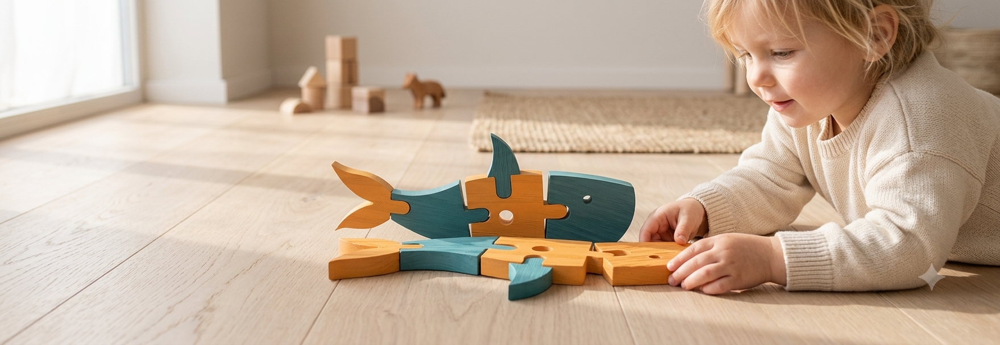
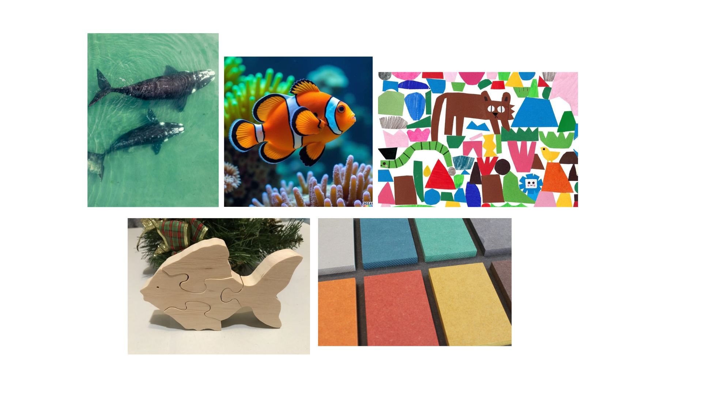
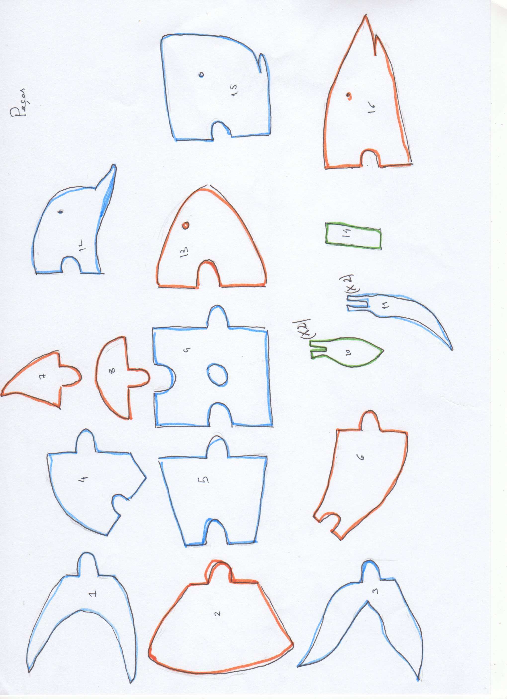
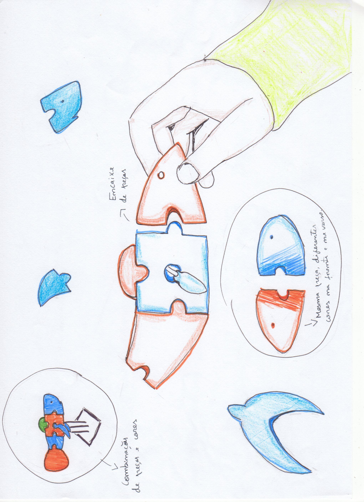

# Leia

<!--
  HERO: idealmente uma pseudo-sessão fotográfica do produto
  (ver tutorial Pletor.ai nos Recursos da disciplina, em
  /Recursos/AI_exps/). Usa attachments/hero.jpg para o frontmatter.
-->

> Um puzzle de animais aquáticos que combina peças e cores.

## Conceito

No decorrer do projeto Nestor, criei um puzzle simples, feito de madeira, que mistura
combinações de cores e peças, de modo a originar diferentes animais aquáticos.
Através da modificação, adição ou subtração de peças é possível obter um peixe-palhaço,
um golfinho, um tubarão ou uma baleia, sendo também possível criar um animal aquático
híbrido, de maiores ou menores dimensões, através da mistura de peças de diferentes
animais.
O puzzle foi concebido a pensar nas crianças, em fase de aprendizagem, que gostam de
animais, visto que é muito importante não só arranjar objetos (brinquedos e jogos) que
possam auxiliar no seu aprendizado, mas também que consigam estimular a sua
criatividade e forma de ver o mundo.

## Enquadramento

Assim como o restante do grupo, este brinquedo apresenta a proposta de um puzzle
colorido, com formas simplificadas, que explora a temática dos animais de cada meio
natural, neste caso, focando-se nos animais aquáticos.

## Tecnologia

O puzzle foi projetado para ser fabricado com corte CNC, numa placa de MDF de 12mm,
reutilizada, e com a aplicação de diferentes cores, de modo a ser mais visualmente
atrativo para as crianças.
As peças para corte foram todas feitas no fusion, com o objetivo de poder ser impresso e
também para ajudar a ter uma melhor noção daquilo que é o brinquedo e as alterações
que podem ser feitas.

- Modelo 3D: [<!-- embed Fusion ou link a360.co -->](https://a360.co/4ewDfz9)
- Ficheiros: `attachments/`

## Função

O brinquedo tem como público-alvo crianças a partir dos 6 anos e tem um funcionamento
muito simples, não sendo preciso nenhum manual de instruções.
O principal objetivo é que a criança se sinta à vontade para mexer no brinquedo, juntar e
rodar peças e descobrir as diferentes possibilidades de animais aquáticos que o puzzle
apresenta.

As peças encaixam-se muito facilmente, parecendo realmente um puzzle tradicional só
que com uma maior espessura, o que permite que as peças se equilibrem melhor em pé.
Para além do puzzle, também foi pensada uma base opcional, onde as peças poderiam
ficar mais bem assentes caso a criança não queira brincar mais ou se quiser guardar o
puzzle como um elemento decorativo, por exemplo numa estante.

## Apresentação

Imagens-chave que sintetizam o produto final.
.png)
.jpg)

## Processo

O percurso completo de iterações, modelos e pesquisa está em [processo.md](processo.md), organizado do **mais recente** para o **mais antigo**.

[Ver processo completo →](processo.md)
