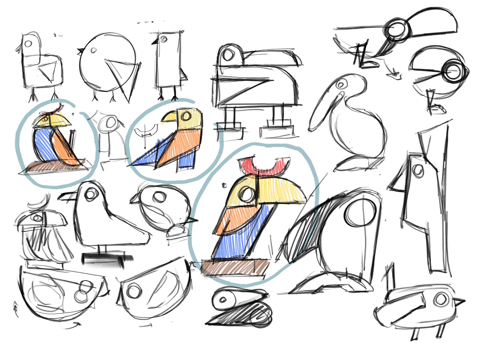
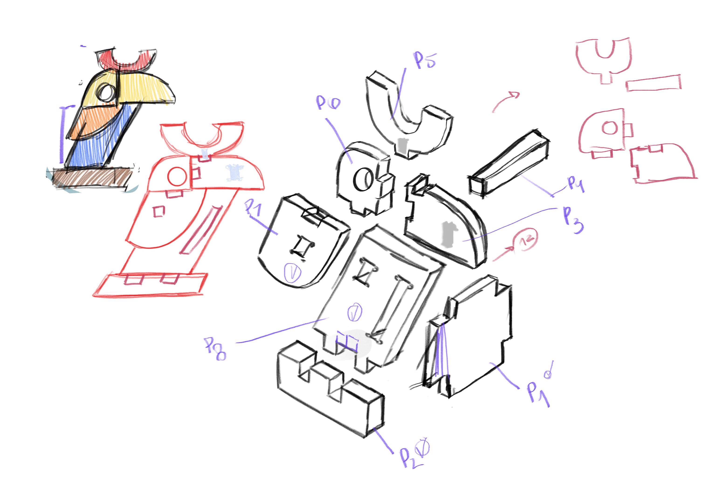
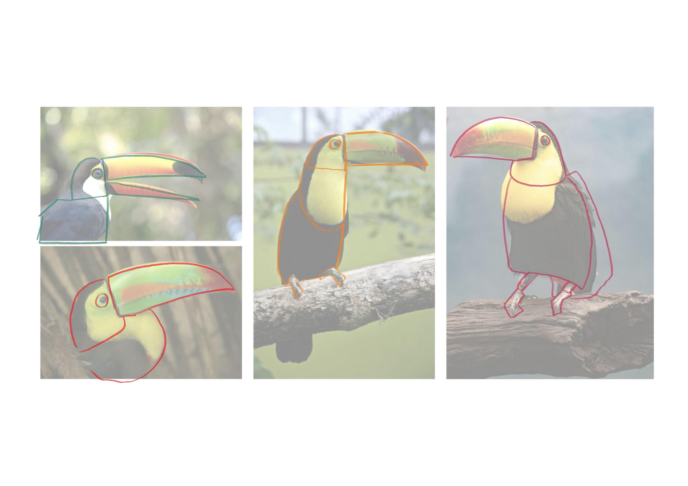

# Processo

> Organizado do **mais recente** para o **mais antigo**. Faz uma seleção que torne clara, aprazível e detalhada a evolução do produto e das ideias.

## 1. Protótipo(s)

Fotografias dos protótipos Finais 

## 2. Processo de Prototipagem

Maquinação CNC, montagem, acabamentos pontuais. 

## 3. Protótipos Exploratórios

Testes CNC prévios, ensaios em escala, experiências de juntas/encaixes.

## 4. Modelos 3D

Embed do Fusion (visualização do modelo paramétrico).
https://a360.co/4d6qv2C

## 5. Outros Modelos

Modelos físicos exploratórios, em cartão, espuma, madeira de teste.

## 6. Esboços e Pranchas-Resumo

Desenhos manuais, 
pranchas A3 de síntese, 
exploração de variantes.

## 7. Pesquisa

### 7.1. Aspectos valorizados do moodboard, desconstrução da forma (o que distingue o programa formal)

A partir do moodboard, com as referências do Tucano o foco centrou-se na simplificação da linguagem visual. O tucano foi desconstruído em volumes básicos, reduzindo detalhes e mantendo apenas as suas características mais reconhecíveis.
Esta simplificação facilita a produção em CNC e a criação de peças funcionais. 

### 7.2. Objetos de referencia

Inventário de precedentes, brinquedos análogos, referências históricas.

.jpg)
1) **Jogos de empilhamento e equilíbrio** – brinquedos em que o utilizador empilha peças sem deixar a estrutura cair, estimulando a concentração, a precisão e a estratégia.
2) **Brinquedos inspirados em animais** – objetos lúdicos que utilizam formas simplificadas de animais como elemento visual e educativo, aproximando as crianças da natureza.
3) **Brinquedos de construção modulares** – sistemas de peças reutilizáveis que permitem diferentes formas de montagem, incentivando a criatividade e a experimentação.
## 9. Outros Elementos

Outros materiais relevantes para a preparação do conceito (entrevistas, observação, testes com utilizadores, notas, leituras, inspirações).
